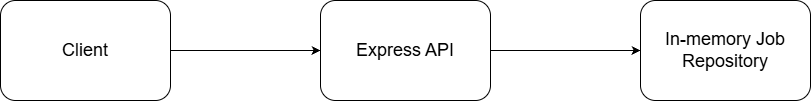
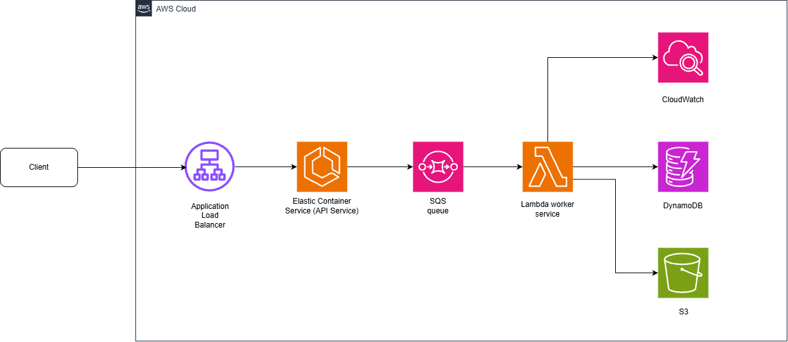

# Cloud Job Processor Architecture

The architecture as it exists and as planned are recorded here and updated regularly

## Current Architecture

## Planned Architecture

## Key Components

- **Client** - submits jobs and queries status
- **API** - exposes endpoints and validates incoming requests
- **Queue (SQS)** - decouples job submission from processing
- **Worker service** - consumes queued jobs and performs the actual processing
- **Job storage (DynamoDB)** - stores job state, metadata and results
- **S3** - optional storage for larger objects
- **CloudWatch** - logs, metrics, alarms for observability/monitoring
- **Terraform(not in diagram)** - provisions and manages the cloud infrastructure

## Why it evolves this way

- The in-memory repository is useful for the initial API, but it is not durable
- Introducing SQS separates job submission from job execution
a worker allows longer-running jobs to be processed asynchronously
- DynamoDB gives persistent job state
- Terraform makes the infrastructure reproducible
- Observability becomes necessary once jobs run across distributed components
- Deployment automation becomes valuable once infrastructure and environments exist